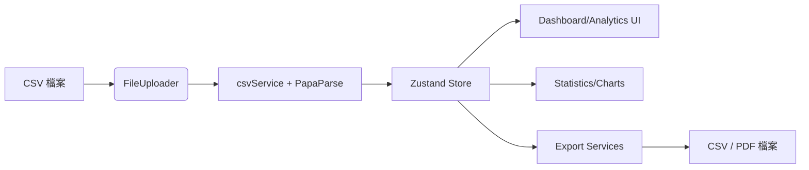

# 發票整理儀表板

> 以 React 18 + TypeScript 打造的電子發票資料整理、分析與匯出平台，支援大檔 CSV 解析、進階視覺化與離線韌性設計。

## 目錄

1. [產品概覽](#1-產品概覽)
2. [架構快照](#2-架構快照)
3. [快速開始](#3-快速開始)
4. [核心工作流程](#4-核心工作流程)
5. [指令與腳本](#5-指令與腳本)
6. [測試與品質門檻](#6-測試與品質門檻)
7. [文檔導覽](#7-文檔導覽)
8. [常見問題](#8-常見問題)
9. [授權](#9-授權)

## 1. 產品概覽

- � **即時儀表板**：統計卡、時間序列與品類圖一頁掌握消費趨勢。
- 📁 **檔案生命週期**：拖放上傳、多檔併行解析、重新處理、錯誤提示一次到位。
- 🔍 **進階分析**：篩選器、可排序資料表、進階圖表 (`Advanced*Chart`) 協助探索。
- 📤 **多元匯出**：CSV 與 PDF 匯出流程附進度追蹤 (`ExportProgressNotification`) 與失敗重試建議。
- 🛡️ **韌性設計**：`ErrorBoundary`、`ErrorNotificationProvider`、`OfflineStatus` 與 `usePerformanceMonitor` 保護使用體驗。

核心頁面與使用者：

| 頁面 | 使用者情境 | 主要元件 |
| --- | --- | --- |
| Dashboard (`src/pages/Dashboard.tsx`) | 首次登入即掌握 KPI、提示上傳資料 | `StatisticsCards`, `TimeSeriesChart`, `CategoryChart` |
| File Manager (`src/pages/FileManager.tsx`) | 上傳 / 重新處理 / 檔案說明 | `FileUploader`, `FileList`, `useFileReprocessing` |
| Analytics (`src/pages/Analytics.tsx`) | 進階篩選、匯出、表格、圖表 | `FilterPanel`, `AdvancedTimeSeriesChart`, `DataTable` |

## 2. 架構快照

| 面向 | 說明 |
| --- | --- |
| 前端 | React 18 + Vite + TypeScript、React Router v6 管理頁面與 Layout。|
| 狀態 | Zustand `useInvoiceStore` + `persist` 將發票、檔案與統計儲存在瀏覽器 storage。|
| CSV 解析 | `PapaParse` 串流解析；`csvService` 結合 `memoryOptimizer` 分批處理大檔並儲存 `originalFileData` 供重跑。|
| 統計/圖表 | `statisticsService` 提供基本與延伸統計，Chart.js + react-chartjs-2 呈現。|
| 匯出 | `exportService`, `pdfExportService`, `exportProgressService` 處理欄位客製、進度與錯誤訊息。|
| 錯誤/韌性 | `errorService`, `ErrorNotificationProvider`, `ErrorBoundary`, `OfflineStatus`，並以 `usePerformanceMonitor` 監控效能。|
| 自動化 | `scripts/run-all-tests.js`, `scripts/verify-integration.js`, `scripts/optimize-build.js` 管理測試、整合檢查與 bundle 分析。|



## 3. 快速開始

### 3.1 必備工具

- Node.js 20+ / npm 10+
- Docker 20.10+（若需容器化）
- Git（選用）

### 3.2 本地開發

```powershell
npm install
npm run dev
# 瀏覽器開啟 http://localhost:3000
```

### 3.3 Docker（推進一致環境）

```powershell
docker-compose --profile dev up -d
# 停止容器
docker-compose down
```

其他 profile：`--profile production` (Nginx 靜態服務)、`--profile production-node` (Node Preview)、`--profile load-balancer` (Nginx LB)。詳見 `DEPLOYMENT.md`。

### 3.4 使用範例資料

- `test/sample-invoice.csv`：單檔測試用。
- `e2e/fixtures/*.csv`：壓力與錯誤情境 (`large-invoices.csv`, `invalid-file.txt`)。
- `invoice/093049055601.csv`：實際案例，可在檔案管理頁面上傳。

### 3.5 環境變數

| 檔案 | 內容 | 說明 |
| --- | --- | --- |
| `.env.development` | `NODE_ENV=development`, `VITE_APP_NAME=發票整理儀表板`, `CHOKIDAR_USEPOLLING=true`, `WATCHPACK_POLLING=true` | 在 VM / Docker 開發時保證檔案偵測。|
| `.env.production` | `NODE_ENV=production`, `VITE_APP_NAME`, `VITE_APP_VERSION` | 建構/部署時載入。|

### 3.6 品質檢查捷徑

- `npm run lint && npm run format:check`
- `npm run test:run`
- `npm run deploy:check`：同時跑完整測試與 bundle 分析。

## 4. 核心工作流程

### 4.1 CSV 上傳與解析

1. `FileUploader` 驗證副檔名、大小 (10MB)、空檔案與拖放體驗。
2. `csvService.processFile(s)`：
	 - 先呼叫 `validateCSVFile`。
	 - 使用 `Papa.parse` chunk 解析，`memoryOptimizer` 分批組合 `Invoice`、減少失控堆積。
	 - 保留 base64 `originalFileData` 以供 `useFileReprocessing` 重新處理。
	 - 錯誤經 `errorService` 標準化並透過 `ErrorNotificationProvider` 顯示。

### 4.2 統計與視覺化

- `statisticsService` 計算總金額、平均、日期區間、時間序列與品類占比，亦提供 `calculateExtendedStatistics`（月報、商家排行、品項頻率、作廢統計）。
- `useInvoiceStore` 中 `refreshStatistics` 確保每次新增/刪除發票即更新。
- Dashboard / Analytics 使用 `Advanced*Chart`、`FilterPanel`、`DataTable` 呈現，`usePerformanceMonitor` 監看渲染時間。

### 4.3 匯出與整合

- `ExportButton` / `CSVExportDialog` / `PDFExportDialog` 透過 `exportService`、`pdfExportService` 實作欄位選擇、明細/摘要模式、PDF 圖表擷取 (`html2canvas + jsPDF`)。
- `exportProgressService` 追蹤進度、提供 retry 與錯誤建議 (`getUserFriendlyErrorMessage`)。
- `scripts/run-all-tests.js` 與 `scripts/verify-integration.js` 作為 CI 前置檢查，確保匯出、圖表與 API 接面保持一致。

## 5. 指令與腳本

| 指令 | 功能 |
| --- | --- |
| `npm run dev` | 啟動 Vite 開發伺服器 (0.0.0.0)。|
| `npm run build` | `tsc` 型別檢查 + `vite build`。|
| `npm run preview` | 以 Vite preview 提供生產 build。|
| `npm run lint` / `lint:fix` | ESLint 驗證 / 自動修正。|
| `npm run format` / `format:check` | Prettier 格式化 / 驗證。|
| `npm run test` / `test:run` / `test:ui` | Vitest watch / CI / UI。|
| `npm run test:coverage` | 產出 coverage 報告。|
| `npm run test:e2e` / `test:e2e:ui` | Playwright E2E（headless/GUI）。|
| `npm run test:all` | 執行 `scripts/run-all-tests.js`（單元 + 整合 + 覆蓋率 + build + E2E + 報告）。|
| `npm run docker:*` | `docker:dev`, `docker:prod`, `docker:prod-node`, `docker:stop`, `docker:logs`。|
| `npm run build:analyze` | 重新建置並由 `scripts/optimize-build.js` 產出 `build-report.json`。|
| `npm run deploy:check` | 串接 `test:all` 與 `build:analyze`，做為部署前品質門檻。|

## 6. 測試與品質門檻

### 6.1 單元 / 整合

```powershell
npm run test:run -- --reporter=verbose
npm run test:run -- src/test/integration
```

- 單元測試涵蓋 `src/lib/__tests__`, `src/components/__tests__`。
- 整合測試鎖定 `src/test/integration`（含 `fullIntegration.test.tsx`）。

### 6.2 E2E / 覆蓋率 / 一鍵檢查

```powershell
npm run test:e2e
npm run test:coverage
npm run test:all
node scripts/verify-integration.js
```

`test:all` 會輸出 `test-report.json` 與品質門檻，`verify-integration` 會生成 `integration-verification.json`。

### 6.3 品質 Gate 建議

| Gate | 門檻 | 來源 |
| --- | --- | --- |
| 測試成功率 | ≥ 95% | `scripts/run-all-tests.js` summary |
| 覆蓋率 | ≥ 80% lines | 同上 coverage |
| 建置成功 | 必須通過 | `npm run build` |

## 7. 文檔導覽

- `DEPLOYMENT.md`：環境需求、Docker profile、監控/備援操作手冊。
- `docs/PROJECT_GUIDE.md`：深入模組解析、資料流程、測試策略與操作守則。
- `integration-verification.json`：最近一次整合檢查的結果，可作為運維記錄。

## 8. 常見問題

### 8.1 為什麼解析出來的品項名稱會變成數字？

部分電子發票服務在匯出 CSV 時，明細 D 行的欄位順序為「發票號碼 → 金額 → 品項名稱」，而不是傳統的「發票號碼 → 品項名稱 → 金額」。`parseDLine` 會檢查第三、第四欄是否為數字並自動調整，因此不論欄位順序為何都能正確還原品項。

### 8.2 大檔案解析到一半失敗？

- 檢查檔案是否超過 `FileUploader` 10MB 限制。
- 若需要更大檔，可在 Docker 模式中修改 `MAX_FILE_SIZE` 並重新建置。
- 觀察瀏覽器記憶體；`memoryOptimizer` 會分批釋放，但仍建議分割檔案或逐步上傳。

### 8.3 匯出 PDF/CSV 沒反應？

- 確認瀏覽器允許下載並未封鎖彈出視窗。
- 於 Console 是否有 `exportProgressService` 回報的 `error`，可依訊息嘗試重新產出。
- 若匯出量大，可在 Analytics 篩選後再匯出，或改用 CSV 摘要模式。

### 8.4 為何儀表板沒有更新數據？

- `useInvoiceStore.refreshStatistics()` 會在成功上傳/重新處理後觸發；若仍無資料，請確認檔案是否含 M 行 + D 行，或手動點擊 File Manager 的「重新整理統計」。

## 9. 授權

MIT License